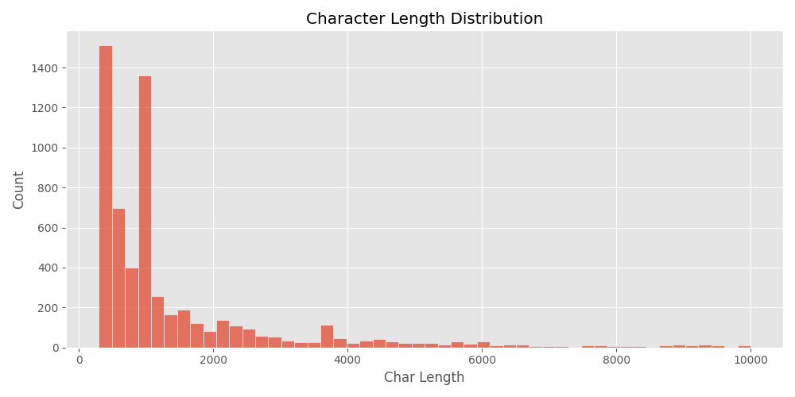
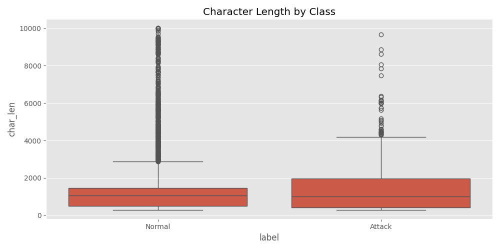
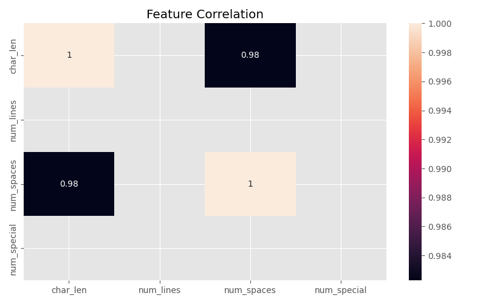

#  ADFA System Call Anomaly Detection  
Unsupervised Log Analysis Using Isolation Forest + Feature-Based Rules  
Hosted on HuggingFace Spaces  
 **Live Demo:** https://huggingface.co/spaces/NauRaa/ADFA_System_Call_Anomaly_Detection

---

##  Overview  

This project implements an **unsupervised anomaly detection system** for ADFA system-call logs using:

- **Isolation Forest (Unsupervised ML)**
- **Feature-specific statistical rules**
- **Custom log feature engineering**
- **Interpretability visualizations**
- **Interactive Gradio dashboard**
- **Real-time detection with auto-generated feature plots**

The model is designed to detect **suspicious behaviors** in system call sequences without requiring labeled data — following real-world SIEM / SOC workflows.

This repository contains the full pipeline:
1. Dataset parsing    
2. Feature engineering  
3. Unsupervised Isolation Forest training  
4. Extended rules model  
5. Visualization & explainability tools  
6. Interactive UI (Gradio)  
7. Deployment on HuggingFace

---
##  Visualizations -->

### Histogram of char Length
 

### Compare char_len per split



### Heatmap


> Replace the above images with actual figures from the analysis.

---

##  Project Structure  

```

.
├── app_unsupervised.py         # Full Gradio application
├── adfa_parsed.csv             # Parsed ADFA logs (text + labels)
├── unsup_iforest_pipeline.pkl  # Trained Isolation Forest pipeline
├── feature_rules.npy           # Feature rule thresholds
├── char_length_dist.png        # Visualization
├── char_len_by_class.png       # Visualization
├── correlation_heatmap.png     # Visualization
└── README.md

```

---

##  Model Approach

### ✔ 1. **Unsupervised Isolation Forest**
We trained an Isolation Forest pipeline on:
- Log length  
- Unique system calls  
- Mean system-call ID (log-transformed)

```

1  → Normal
-1 → Anomaly

````

### ✔ 2. **Feature-Based Rule System (Extended Model)**

Added rule-based detection to support IF limitations:

| Feature | Rule Example | Purpose |
|--------|--------------|---------|
| length | > 2× mean | Detect abnormally long sequences |
| unique_calls | > 2× mean | Detect rare syscall combinations |
| mean_call_log | > log1p(1000) | Detect high syscall IDs |

These rules significantly reduce:  
✔ false positives  
✔ model over-triggering  
✔ noise sensitivity  

### ✔ 3. **Real-Time Visualization**

Each detection generates:
- A comparison bar chart between user input and normal means  
- Colored anomaly highlighting (blue = normal, red = exceeds threshold)

---

## Feature Engineering

We extract meaningful features from raw ADFA logs:

```python
def make_numeric_features(texts):
    X["length"] = number of words
    X["unique_calls"] = unique syscall count
    X["mean_call_log"] = log-mean of numeric syscall IDs
````

This simplified approach keeps the model explainable and reproducible.

---

##  System Features (Gradio App)

###  Real-time anomaly detection

###  Auto-generated feature plots

###  Visual comparison to dataset means

###  Integrated model + rule engine

###  Clean modern CSS styling

###  Multiple dataset visualizations:

* Character-length distribution
* Distribution by class
* Correlation heatmap

---

## User Interface (Screenshot Recommended)

The dashboard contains 2 main tabs:

### ** Dataset Visualizations**

All preprocessing visualizations automatically loaded.

### ** Real-Time Detection**

Paste a system-call log → get prediction + plot immediately.

---

##  Deployment

⁃ App deployed on HuggingFace Spaces
⁃ Pipeline fully compatible with `Gradio Blocks`
⁃ Ready for scaling on GPU/CPU Spaces

 **Live Demo:**
[https://huggingface.co/spaces/NauRaa/ADFA_System_Call_Anomaly_Detection](https://huggingface.co/spaces/NauRaa/ADFA_System_Call_Anomaly_Detection)

---

##  Important Note

> *This unsupervised model may occasionally make mistakes — especially when processing very unusual or extremely short logs. Isolation Forest is sensitive to distribution shapes and may over-flag anomalies without enough contextual data.*

This note is also displayed inside the UI.

---

##  Future Improvements

* Add sequence models (LSTM / GRU / Transformer)
* Expand feature engineering with syscall embedding
* Add PCA/UMAP visualization inside the UI
* Introduce supervised fine-tuning with labeled anomalies

---

##  Author

**NauRaa**

Data Scientist & AI Engineer

---
